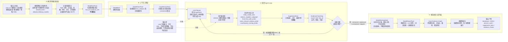

# Phase 2/3 Agent Loop 技术实现链路图

```mermaid
flowchart LR
  subgraph A["A. 确定性基础事实层"]
    A1["输入与约束<br/>case_id / 模型树 / 已选模型<br/>模型结果表 / 图表映射 / 策略 YAML"]
    A2["模型策略与字段角色<br/>实体/账户/金额/时间/关系边<br/>allowed_tools / allowed_followup_models"]
    A3["全量扫描聚合<br/>TopK 主体、关系边、金额、时间、对手、异常规则<br/>证据样本不超过 200 行"]
    A4["ModelFactPack<br/>每模型基础事实<br/>fact_id / evidence_refs<br/><b>不可覆盖</b>"]
    A1 --> A2 --> A3 --> A4
  end

  subgraph B["B. 上下文工程层"]
    B1["ModelBrief<br/>逐模型压缩"]
    B2["ModelClassPack<br/>按模型树/root_category 聚合同类模型"]
    B3["CasePlannerPack<br/>只保留高价值线索和 unresolved 假设"]
    B1 --> B2 --> B3
  end

  subgraph C["C. 受控 Agent Loop"]
    C1["LLM Planner<br/>提出 hypothesis<br/>选择白名单工具和参数<br/>不得生成 SQL"]
    C2["执行器校验<br/>schema / 模型调用边 / 参数来源 / 预算"]
    C3["白名单补证工具<br/>entity_model_slice<br/>relation_neighbor_subgraph<br/>fund_flow_path_probe<br/>same_amount_window_probe<br/>counterparty_overlap_probe"]
    C4["SupplementFact<br/>工具结果、入参、证据引用<br/><b>只追加</b>"]
    C5["EvidenceChainStep<br/>round / tool / fact_id<br/>支持、削弱、存疑"]
    C6{"证据足够<br/>或到达预算？"}
    C1 --> C2 --> C3 --> C4 --> C5 --> C6
    C6 -- "否：补证摘要回填 Brief，进入下一轮" --> C1
  end

  subgraph D["D. 报告状态与交付层"]
    D1["ModelWorkingState<br/>当前关注对象、筛选口径、待补证状态<br/>追加版本，不覆盖基础事实"]
    D2["ModelReportPack<br/>基础事实 + LLM 研判 + 补证结果 + 证据链结论"]
    D3["Case Evidence Graph<br/>跨模型主体、关系边、路径、假设终态"]
    D4["逐模型报告<br/>按模型树排序，每个模型都展示"]
    D5["输出产物<br/>Markdown / JSON / planner_audit / supplement_facts / evidence_chains"]
    D1 --> D2 --> D3 --> D4 --> D5
  end

  A4 --> B1
  B3 --> C1
  C6 -- "是：enhanced / weakened / unresolved / skipped" --> D1

  Guard["硬边界<br/>LLM 不算数字、不写 SQL、不读全量明细、不自由选模型、不把未验证线索写成结论"]
  Guard -.约束.-> C1
  Guard -.约束.-> C2
```

